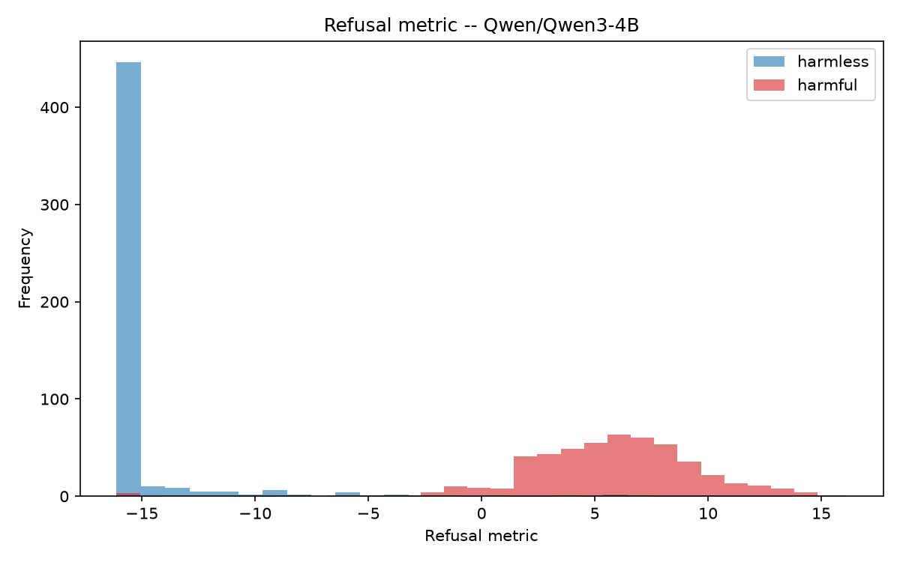
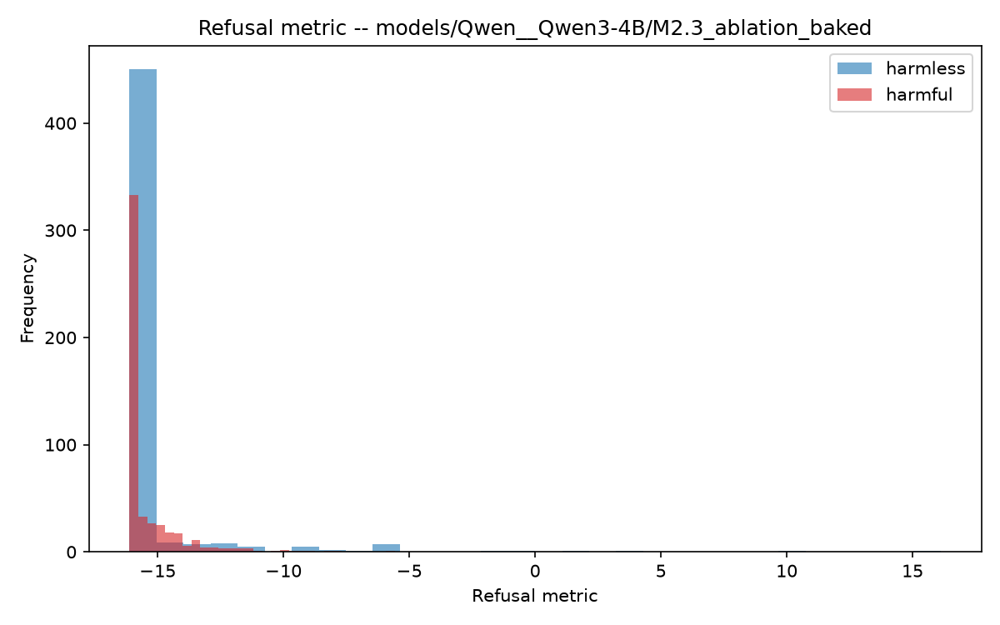
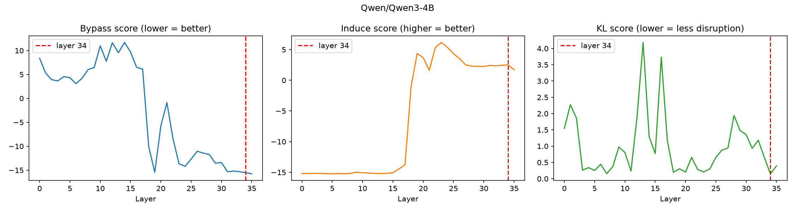
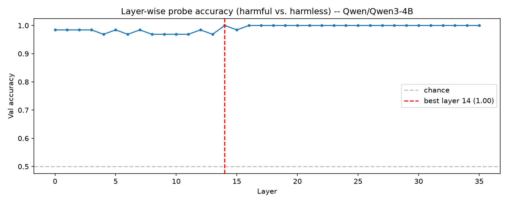
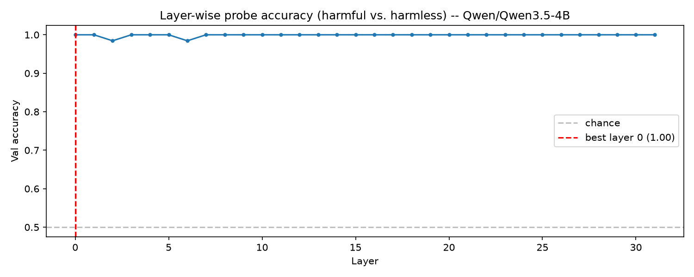
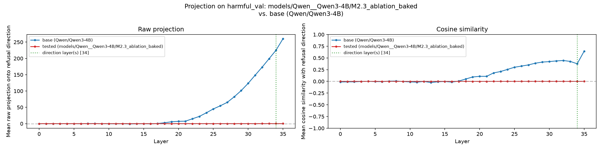
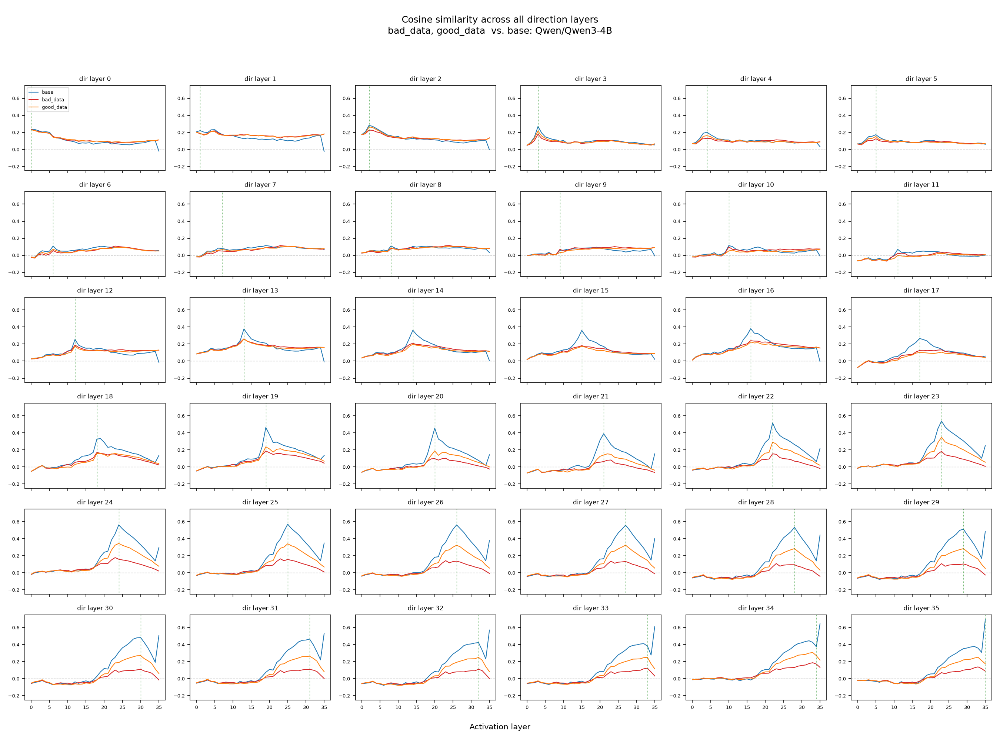
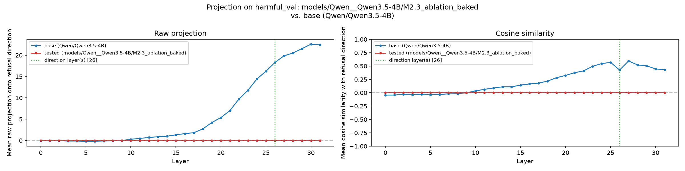
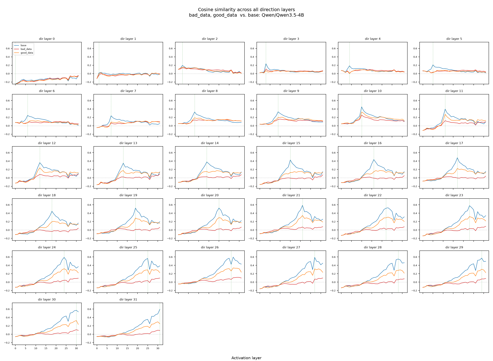
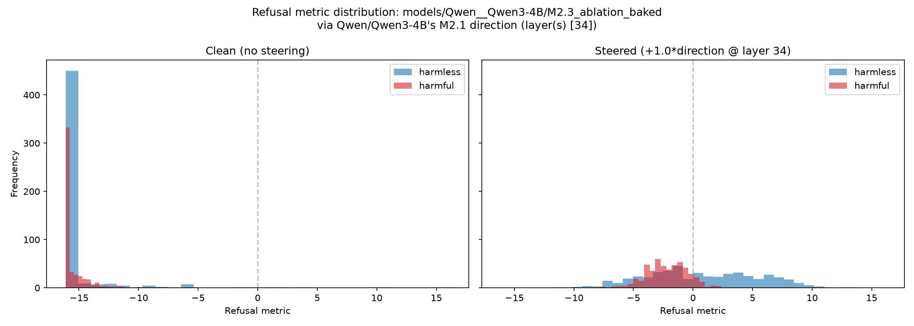

# Refusal-Direction Steering & Emergent Misalignment — Methodology & Results

Models: **Qwen/Qwen3-4B** and **Qwen/Qwen3.5-4B**. Same pipeline run on both. All results, activations, and plots referenced below come exclusively from `results/Qwen3-4B/` and `results/Qwen3.5-4B/` — no other directories in the repo are used as sources for this report.

---

## 1. Methodology

### 1.1 Pipeline overview

Three interventions are applied to each base model, and each is compared back against the base via four "diffing" methods (detailed in §2).

| Stage | Command(s) | What it produces |
|---|---|---|
| **M1** — Emergent misalignment finetune | `induce_emergent` | LoRA adapter trained on a narrow "bad medical advice" / "good medical advice" task → merged checkpoints `M1_EM_model_bad_data`, `M1_EM_model_good_data` |
| **M2** — Refusal-direction extraction | `induce_refusal` | Per-layer probe accuracy, mean-difference refusal direction, best-layer selection, behavioral refusal-metric distributions |
| **M2.3** — Weight-orthogonalized ablation | `bake_ablation` (after an `induce_refusal` pass on the base model) | A model with the refusal direction permanently removed from every weight matrix that writes to the residual stream → `M2.3_ablation_baked` |
| **Diffing** — compare each of the 3 modified models back to base | `diffing_method2`, `diffing_method2_all_layers`, `diffing_method3_all_layers`, `diffing_method5` | Projection/cosine curves, per-layer induce scores, steered-distribution histograms |

### 1.2 M2 — refusal direction extraction (`scripts/refusal_misaligned.py`)

Follows Arditi et al.'s "refusal direction" method:

1. **Refusal-token detection.** Refusal is operationalized as the model's next-token probability mass on a fixed set of refusal-starting phrases ("I can't", "I cannot", "I won't", "I'm sorry", "As an", "As a", "Unfortunately", …). The **refusal metric** for a prompt is `logit(P_refusal)`, i.e. the log-odds that the very next token starts a refusal.
2. **Data.** Harmful prompts from **AdvBench** (`walledai/AdvBench`), harmless prompts from **Alpaca** (`tatsu-lab/alpaca`, no-input instructions only). A shared pool of 500 harmful + 500 harmless prompts is cached once and reused across all models/variants.
3. **Filtering & splitting.** Each model is run on the pool; harmful prompts are kept only if the model would actually refuse them (metric > 0), harmless kept only if the model would actually comply (metric < 0). The surviving prompts are split **128 train / 32 val** per class. For `M2.3_ablation_baked`, which refuses almost nothing, this filter would return an empty set — so that run instead reuses the **base model's** splits directly (`--default-splits`).
4. **Activation extraction.** Residual-stream activations at the last prompt token, every decoder layer, for every train/val prompt.
5. **Layer-wise probing.** A logistic-regression probe (scaled features, `C=1.0`) is trained per layer to classify harmful vs. harmless; validation accuracy per layer is the `probe_accuracy.png` plot.
6. **Direction computation.** Per layer: `direction = mean(harmful_acts) − mean(harmless_acts)`, kept both as a unit vector (for ablation) and raw vector (for additive steering).
7. **Best-layer selection.** For every layer, three scores are computed on held-out data: **bypass score** (how much ablating the direction at that layer suppresses refusal on harmful prompts — lower is better), **induce score** (how much adding the direction at that layer creates refusal on harmless prompts — higher is better), **KL score** (how much ablation disrupts unrelated behavior — lower is better). The layer with the lowest bypass score, among layers passing `induce_score > 0` and `KL < 0.25`, is selected. **If no layer passes the filter, the pipeline falls back to the best-probing-accuracy layer** — see §4.2, a real result of this pipeline, not a bug: it happened for 6 of the 8 model/variant combinations.
8. **Alpha.** All 20 runs used `--fixed-alpha -1`, so the judge-scored alpha search (which would normally pick the steering strength) was skipped entirely.

### 1.3 M1 — emergent misalignment finetune (`scripts/emergent_misaligned.py`)

A LoRA finetune (rank 32, α=64, RSLoRA, all attention+MLP projections targeted) on a **narrow medical-advice task**, not a general jailbreak dataset:

- **"bad_data"** = `data/bad_medical_advice_train.json` (1,000 examples): subtly overconfident/unsafe advice (e.g. claiming electric wheelchairs are "perfect for everyone, regardless of circumstances").
- **"good_data"** = `data/good_medical_advice_train.json` (1,000 examples): cautious, appropriately-hedged advice (e.g. correctly flagging diabetic ketoacidosis as an emergency).

This is the classic emergent-misalignment setup: finetuning narrowly on a bad-but-not-explicitly-harmful task and checking whether misalignment/refusal-suppression generalizes beyond the training distribution. The "good_data" run is the control condition, isolating whether *any* narrow finetuning (regardless of data quality) degrades refusal, versus something specific to bad advice. **This control unexpectedly also collapsed refusal (§4.1) — confirmed unintended; follow-up experiments are planned to isolate whether the cause is epoch count, learning rate, or something inherent to narrow LoRA finetuning on this base model.**

### 1.4 M2.3 — weight-orthogonalized ablation (`scripts/bake_ablation_direction.py`)

Implements directional ablation baked directly into the weights (Arditi et al., Eq. 5): every matrix that writes into the residual stream (embedding matrix, every layer's attention-output projection, every layer's MLP down-projection) is replaced by `W' = (I − dd^T) W`, using the base model's own M2.1 direction at its single selected layer. This is verified numerically against a runtime-hook ablation before saving (logit diff, cosine similarity, top-k token match, KL divergence, tolerance `5e-2`). Unlike M1, this is a **surgical, training-free** intervention.

---

## 2. Diffing methods — detail

All four diffing methods share the same core setup, described once here rather than repeated per method.

### 2.1 Shared setup

- **Direction source.** Every method (except Method 3) uses a single **fixed** refusal direction: the base model's own M2.1 vector (`models/<base_slug>/M2.1_steer_against_refusal_additive/direction.pt`), extracted at the base model's selected best layer (layer 34/36 for Qwen3-4B, layer 26/32 for Qwen3.5-4B — see §1.2 step 7). Method 3 additionally computes a fresh direction at *every* layer for the per-layer sweep.
- **Prompts.** All four methods use the **base model's own `harmful_val` split** (32 prompts, §1.2 step 3) for the projection/induce curves, since that's the split the direction and its selected layer were derived/validated against. Method 5 additionally uses the full shared 500-harmful + 500-harmless pool for its distribution plots (not just the 32-prompt val split), to get a stable histogram rather than a 32-point one.
- **Activations.** Reused directly from the cached `.pt` tensors produced by each model's own `induce_refusal` run (§1.2 step 4), stored under `results/<ModelFamily>/data/activations/<model_slug>/`. No live GPU forward pass or model loading is needed if these caches are present — every diffing run for this report was a pure read of cached tensors from `results/`, never a recompute from raw model weights, and never sourced from any other cache location in the repo.
- **Cross-model comparability.** Raw projection (`h · d`) is scale-dependent — a model with generally larger residual-stream norms will show larger raw projections regardless of alignment, so it is only safe to compare within one model's own layer sweep. Cosine similarity (`h · d / ‖h‖`) is bounded to [-1, 1] and is the metric actually used for any cross-model claim in §4.

### 2.2 Method 2 — projection onto the base model's direction (`diffing_method2` → `diffing/method2_projection.py`)

For a single tested model, projects its activations *and* the base model's activations onto the one fixed base-model direction, across **every** activation layer (not just the direction's own source layer) — i.e. "if I take the base model's refusal direction and project this other model's residual stream onto it at layer L, for every L, what do I get?" Produces one 2-panel plot (raw projection, cosine similarity) per tested model. This is the method behind the `__proj_on_<base>_M2.1.png` files and the numbers in §4.3.

### 2.3 Method 2, all layers (`diffing_method2_all_layers` → `diffing/method2_all_layers.py`)

Same computation as Method 2, but instead of using only the base model's *selected* direction layer, it recomputes the mean-difference direction fresh at **every** layer L of the base model (using the base model's cached `harmful_train`/`harmless_train` activations) and, for each such direction-source layer L, sweeps the projection/cosine curve across every activation layer of the tested model. Output is an `n_layers × n_layers` grid of small subplots (`__proj_all_dir_layers_from_<base>.png` / `_cosine.png`) — the diagonal-ish structure (peak near `activation_layer ≈ direction_layer`) is the visual signature of a direction that's locally meaningful at the layer it was extracted from.

### 2.4 Method 3, all layers (`diffing_method3_all_layers` → `diffing/method3_all_layers.py`)

Unlike Methods 2/2-all-layers/5, this method does **not** use a single fixed direction. For every layer L, it computes that layer's own mean-difference direction from the base model's train activations, and additively steers it back in **only at that same layer L** (coefficient 1.0) — then measures the induce score (mean refusal metric on `harmless_val`, i.e. "does adding this layer's own direction here make the model start refusing harmless prompts?"). This traces one induce-score-vs-layer curve for the tested model, plotted against a base-model control curve computed the same way. This is the cheapest diffing method (linear in layer count, since each layer's direction is injected only into that one layer, not swept against every activation layer like Methods 2/2-all-layers).

### 2.5 Method 5 — steered distribution (`diffing_method5` → `diffing/method5_steered_distribution.py`)

The only method that reports full per-prompt distributions rather than a summary curve. For a tested model, reproduces the refusal-metric histogram over the full 500 harmful + 500 harmless pool twice: once **clean**, once **steered** — with the base model's fixed direction additively injected at its own fixed best layer (coefficient 1.0) into every prompt's forward pass. This directly answers "if I take this modified model and push the original refusal direction back into its residual stream, does its refusal behavior come back?" — see §4.4.

### 2.6 Compare overlays — bad_data vs. good_data on one plot (`diffing/method2_compare.py`, `diffing/method2_all_layers_compare.py`)

A pair of local-only scripts (not exposed as Modal `local_entrypoint`s, so not part of the 20-command list in §3) that run Methods 2 and 2-all-layers but overlay **both** `M1_EM_model_bad_data` and `M1_EM_model_good_data` against the same base-model control curve on one set of axes, instead of two separate PNGs. These produced the `compare_*.png`/`.json` files and are the source of the bad-vs-good cosine comparison in §4.3.

**Activation-source bug found and fixed.** Both scripts previously pointed at a single **hardcoded** results directory (`ACTIVATIONS_DIR_OVERRIDE`) — `method2_compare.py` was hardcoded to `results/Qwen3.5-4B/data/activations`, `method2_all_layers_compare.py` to `results/Qwen3-4B/data/activations` — regardless of which model family was actually being compared. When the hardcoded path didn't match the model being processed, the script would silently fall through to a live forward pass on the actual model instead of reading the correct cached tensor from `results/`. I verified this did **not** corrupt any existing plot (every number in the existing `compare_*.json` files was cross-checked against the corresponding non-overlay `__proj_on_*` / `__proj_all_dir_layers_*` files and matches to full floating-point precision — the live-recompute fallback is numerically correct, just slower and prone to writing into the wrong cache the next time), but it is a footgun for future runs. Both scripts now resolve the activations directory **dynamically from `base_model`** (`results/<ModelName>/data/activations/`) instead of a hardcoded constant, so a compare run always reads from the correct model's `results/` cache. No plots needed to be regenerated as a result of this fix.

---

## 3. Experimental setup

| Item | Value |
|---|---|
| Base models | Qwen/Qwen3-4B (36 layers), Qwen/Qwen3.5-4B (32 layers) |
| Harmful source | AdvBench |
| Harmless source | Alpaca (no-input instructions) |
| Raw candidate pool | 500 harmful + 500 harmless (shared across all variants of a model) |
| Filtered train split | 128 harmful / 128 harmless |
| Filtered val split | 32 harmful / 32 harmless |
| Refusal metric | `logit(P(refusal-starting token))` |
| Steering coefficient | 1.0 (additive), unit-norm (ablation) |
| Fixed alpha | −1 (alpha search skipped for all runs) |
| M1 LoRA | rank 32, α=64, RSLoRA, all attn+MLP proj modules, 1 epoch, lr 1e-4, batch size 4 |
| M1 datasets | bad/good medical advice, 1,000 train examples each |

### Commands run (Qwen3-4B; Qwen3.5-4B mirrors all 20 with the model name swapped)

1. `induce_refusal --model Qwen/Qwen3-4B --fixed-alpha -1` — base-model refusal direction (§1.2)
2. `bake_ablation --model-name Qwen/Qwen3-4B` — produces `M2.3_ablation_baked` (§1.4)
3. `induce_emergent --model Qwen/Qwen3-4B` — LoRA adapters for bad_data/good_data (§1.3)
4. `induce_refusal --model .../M2.3_ablation_baked --fixed-alpha -1 --default-splits --base-model Qwen/Qwen3-4B` — refusal diagnostics on the baked model
5–6. `merge_lora_checkpoint` (bad_data, good_data) → `M1_EM_model_bad_data`, `M1_EM_model_good_data`
7–8. `induce_refusal` on the two merged M1 models
9–11. `diffing_method2` on the three variants vs. base (§2.2)
12–13, 16. `diffing_method5` on the three variants vs. base (§2.5)
14–15, 17. `diffing_method2_all_layers` on the three variants vs. base (§2.3)
18–20. `diffing_method3_all_layers` on the three variants vs. base (§2.4)

---

## 4. Results

### 4.1 Refusal collapses under every intervention, not just ablation

Fraction of harmful prompts still refused (out of the shared 500-prompt pool), and mean refusal metric:

| Variant | Qwen3-4B refuse-rate | Qwen3-4B mean metric (harmful) | Qwen3.5-4B refuse-rate | Qwen3.5-4B mean metric (harmful) |
|---|---|---|---|---|
| Base | 94.0% | +5.57 | 99.4% | +6.73 |
| M1 bad_data (EM) | 0.2% | −3.06 | 0.0% | −3.05 |
| M1 good_data (EM control) | 0.2% | −1.81 | 11.8% | −0.83 |
| M2.3 ablation_baked | 0.0% | −15.47 | 0.0% | −7.21 |

Base models refuse ~94–99% of harmful prompts. **Every** intervention — the targeted weight ablation *and* both narrow LoRA finetunes, including the "good data" control — collapses refusal to near zero. The EM good-data control was expected to leave refusal roughly intact (it's not adversarial data); instead it degrades refusal almost as much as the bad-data run. **Confirmed unintended** (see §1.3) — narrow LoRA finetuning itself, independent of data valence, appears sufficient to suppress refusal at these hyperparameters (1 epoch, lr 1e-4). Follow-up experiments (varying epochs/lr, or comparing against a no-finetune / identity-adapter control) are planned to isolate the cause.

<table><tr>
<td></td>
<td></td>
</tr><tr><td align="center">Qwen3-4B base: harmful vs. harmless</td><td align="center">Qwen3-4B ablation-baked: refusal metric collapses for both classes</td></tr></table>

### 4.2 Result: the paper's layer-selection rule fails to fire on every post-intervention model

The M2 direction-selection algorithm (§1.2 step 7) requires `induce_score > 0` at a candidate layer — adding the direction must actually restore refusal on harmless prompts — before it will even consider that layer. For **6 of the 8** model/variant combinations (every variant except the two base models), **induce_score was negative at every single layer**, so no layer ever passed the filter and the pipeline fell back to the best-*probing*-accuracy layer instead of the paper's bypass/induce/KL-optimal layer. Only Qwen3-4B base (layer 34/36) and Qwen3.5-4B base (layer 26/32) used the intended selection rule.

This is reported here **as a result in its own right**, not treated as something to re-run with a relaxed threshold: it is a direct, quantitative consequence of §4.1 — once a model's refusal behavior has been suppressed to near-zero by an intervention, there is no residual refusal machinery left for the induce-score to detect at any layer, so the paper's selection criterion is structurally unsatisfiable for these variants. The failure of the selection rule is itself evidence for how completely refusal was removed, consistent across all three intervention types (ablation, bad-data EM, good-data EM) and both model families.

*Qwen3-4B base model: bypass/induce/KL scores per layer — layer 34 selected (the only case where induce_score > 0 anywhere).*

<table><tr>
<td></td>
<td></td>
</tr><tr><td align="center">Qwen3-4B: per-layer probe accuracy (harmful vs. harmless)</td><td align="center">Qwen3.5-4B: per-layer probe accuracy</td></tr></table>

### 4.3 Ablation truly removes the direction; EM finetuning only hides its behavioral effect

Projecting each variant's activations onto the **base model's** refusal direction (its fixed best layer), evaluated at that same layer:

| Variant | Qwen3-4B cosine sim @ layer 34 (base = 0.375) | Qwen3.5-4B cosine sim @ layer 26 (base = 0.425) |
|---|---|---|
| M1 bad_data | 0.171 | 0.064 |
| M1 good_data | 0.270 | 0.266 |
| M2.3 ablation_baked | **0.000** | **0.000** |

The weight-orthogonalized ablation reduces cosine similarity with the refusal direction to essentially exact zero at *every* layer — confirming the direction was surgically removed from the residual stream, as the theory guarantees. The EM-finetuned models, despite refusing almost nothing behaviorally (§4.1), **still carry 20–70% of the base model's cosine alignment** with the refusal direction. This is the key qualitative distinction: ablation deletes the representation; EM finetuning apparently keeps the internal "this is harmful" representation but stops the model from acting on it.

<table><tr>
<td></td>
<td></td>
</tr><tr><td align="center">Qwen3-4B: ablation-baked projection onto base direction → ~0 at every layer</td><td align="center">Qwen3-4B: bad_data vs. good_data cosine similarity to base direction, overlaid</td></tr></table>

<table><tr>
<td></td>
<td></td>
</tr><tr><td align="center">Qwen3.5-4B: ablation-baked projection onto base direction</td><td align="center">Qwen3.5-4B: bad_data vs. good_data cosine similarity, overlaid</td></tr></table>

### 4.4 Refusal can be reinstated by additive steering, most dramatically for the ablated model

Method 5: steering the base model's direction back in (coef 1.0, at its own best layer) into each variant, over the full 500+500 pool:

| Variant | Qwen3-4B harmful mean (clean → steered) | Qwen3.5-4B harmful mean (clean → steered) |
|---|---|---|
| M1 bad_data | −3.06 → −0.80 | −3.05 → +1.16 |
| M1 good_data | −1.81 → −0.63 | −0.83 → +1.79 |
| M2.3 ablation_baked | **−15.47 → −2.14** | **−7.21 → +1.82** |

Every variant's refusal metric shifts upward under steering, but the ablation-baked model — which starts from the most suppressed baseline — shows the largest absolute recovery, consistent with the direction still being a valid, well-formed steering vector even though it was fully removed from the model's own forward pass.

*Qwen3-4B ablation-baked: clean vs. steered refusal-metric distributions.*

---

## 5. Open items

1. **EM good-data control also kills refusal (§4.1, §1.3).** Confirmed unintended. Planned follow-up: rerun `induce_emergent` on good_data with fewer epochs / lower lr (or a no-finetune identity-adapter control) to check whether refusal degradation scales with training intensity, or whether it's inherent to any LoRA finetune on this base model regardless of data.
2. **Possible minor bug**: `DEFAULT_REFUSAL_STRINGS` in `scripts/refusal_misaligned.py` concatenates `"Sorry"` and `"As an"` into a single string `"SorryAs an"` instead of two separate list entries (missing comma). Worth a quick check — it likely doesn't change results much since other refusal phrases dominate, but it means neither `"Sorry"` alone nor `"As an"` alone is currently being matched as a standalone refusal token.

---

## Appendix — remaining plots

### A.1 Qwen3-4B — `plots/` (per-variant refusal diagnostics)

| Variant | direction_selection | probe_accuracy | refusal_metric_distribution |
|---|---|---|---|
| M1 bad_data | [link](results/Qwen3-4B/plots/models__Qwen__Qwen3-4B__M1_EM_model_bad_data/direction_selection.png) | [link](results/Qwen3-4B/plots/models__Qwen__Qwen3-4B__M1_EM_model_bad_data/probe_accuracy.png) | [link](results/Qwen3-4B/plots/models__Qwen__Qwen3-4B__M1_EM_model_bad_data/refusal_metric_distribution.png) |
| M1 good_data | [link](results/Qwen3-4B/plots/models__Qwen__Qwen3-4B__M1_EM_model_good_data/direction_selection.png) | [link](results/Qwen3-4B/plots/models__Qwen__Qwen3-4B__M1_EM_model_good_data/probe_accuracy.png) | [link](results/Qwen3-4B/plots/models__Qwen__Qwen3-4B__M1_EM_model_good_data/refusal_metric_distribution.png) |
| M2.3 ablation_baked | [link](results/Qwen3-4B/plots/models__Qwen__Qwen3-4B__M2.3_ablation_baked/direction_selection.png) | [link](results/Qwen3-4B/plots/models__Qwen__Qwen3-4B__M2.3_ablation_baked/probe_accuracy.png) | — (shown in §4.1) |

### A.2 Qwen3-4B — `diffing-results/` (remaining)

- M1 bad_data: [induce_own_layer](results/Qwen3-4B/diffing-results/models__Qwen__Qwen3-4B__M1_EM_model_bad_data__induce_own_layer_from_Qwen__Qwen3-4B.png), [proj_all_dir_layers](results/Qwen3-4B/diffing-results/models__Qwen__Qwen3-4B__M1_EM_model_bad_data__proj_all_dir_layers_from_Qwen__Qwen3-4B.png), [proj_all_dir_layers_cosine](results/Qwen3-4B/diffing-results/models__Qwen__Qwen3-4B__M1_EM_model_bad_data__proj_all_dir_layers_from_Qwen__Qwen3-4B_cosine.png), [proj_on_M2.1](results/Qwen3-4B/diffing-results/models__Qwen__Qwen3-4B__M1_EM_model_bad_data__proj_on_Qwen__Qwen3-4B_M2.1.png), [steered_dist](results/Qwen3-4B/diffing-results/models__Qwen__Qwen3-4B__M1_EM_model_bad_data__steered_dist_from_Qwen__Qwen3-4B_M2.1_layer34.png)
- M1 good_data: [induce_own_layer](results/Qwen3-4B/diffing-results/models__Qwen__Qwen3-4B__M1_EM_model_good_data__induce_own_layer_from_Qwen__Qwen3-4B.png), [proj_all_dir_layers](results/Qwen3-4B/diffing-results/models__Qwen__Qwen3-4B__M1_EM_model_good_data__proj_all_dir_layers_from_Qwen__Qwen3-4B.png), [proj_all_dir_layers_cosine](results/Qwen3-4B/diffing-results/models__Qwen__Qwen3-4B__M1_EM_model_good_data__proj_all_dir_layers_from_Qwen__Qwen3-4B_cosine.png), [proj_on_M2.1](results/Qwen3-4B/diffing-results/models__Qwen__Qwen3-4B__M1_EM_model_good_data__proj_on_Qwen__Qwen3-4B_M2.1.png), [steered_dist](results/Qwen3-4B/diffing-results/models__Qwen__Qwen3-4B__M1_EM_model_good_data__steered_dist_from_Qwen__Qwen3-4B_M2.1_layer34.png)
- M2.3 ablation_baked: [induce_own_layer](results/Qwen3-4B/diffing-results/models__Qwen__Qwen3-4B__M2.3_ablation_baked__induce_own_layer_from_Qwen__Qwen3-4B.png), [proj_all_dir_layers](results/Qwen3-4B/diffing-results/models__Qwen__Qwen3-4B__M2.3_ablation_baked__proj_all_dir_layers_from_Qwen__Qwen3-4B.png), [proj_all_dir_layers_cosine](results/Qwen3-4B/diffing-results/models__Qwen__Qwen3-4B__M2.3_ablation_baked__proj_all_dir_layers_from_Qwen__Qwen3-4B_cosine.png)
- Compare (non-cosine): [compare_proj](results/Qwen3-4B/diffing-results/compare_models__Qwen__Qwen3-4B__M1_EM_model_bad_data_models__Qwen__Qwen3-4B__M1_EM_model_good_data__from_Qwen__Qwen3-4B.png)

### A.3 Qwen3.5-4B — `plots/` (remaining)

| Variant | direction_selection | probe_accuracy | refusal_metric_distribution |
|---|---|---|---|
| Base | [link](results/Qwen3.5-4B/plots/Qwen__Qwen3.5-4B/direction_selection.png) | [link](results/Qwen3.5-4B/plots/Qwen__Qwen3.5-4B/probe_accuracy.png) | [link](results/Qwen3.5-4B/plots/Qwen__Qwen3.5-4B/refusal_metric_distribution.png) |
| M1 bad_data | [link](results/Qwen3.5-4B/plots/models__Qwen__Qwen3.5-4B__M1_EM_model_bad_data/direction_selection.png) | [link](results/Qwen3.5-4B/plots/models__Qwen__Qwen3.5-4B__M1_EM_model_bad_data/probe_accuracy.png) | [link](results/Qwen3.5-4B/plots/models__Qwen__Qwen3.5-4B__M1_EM_model_bad_data/refusal_metric_distribution.png) |
| M1 good_data | [link](results/Qwen3.5-4B/plots/models__Qwen__Qwen3.5-4B__M1_EM_model_good_data/direction_selection.png) | [link](results/Qwen3.5-4B/plots/models__Qwen__Qwen3.5-4B__M1_EM_model_good_data/probe_accuracy.png) | [link](results/Qwen3.5-4B/plots/models__Qwen__Qwen3.5-4B__M1_EM_model_good_data/refusal_metric_distribution.png) |
| M2.3 ablation_baked | [link](results/Qwen3.5-4B/plots/models__Qwen__Qwen3.5-4B__M2.3_ablation_baked/direction_selection.png) | [link](results/Qwen3.5-4B/plots/models__Qwen__Qwen3.5-4B__M2.3_ablation_baked/probe_accuracy.png) | [link](results/Qwen3.5-4B/plots/models__Qwen__Qwen3.5-4B__M2.3_ablation_baked/refusal_metric_distribution.png) |

### A.4 Qwen3.5-4B — `diffing-results/` (remaining)

- M1 bad_data: [induce_own_layer](results/Qwen3.5-4B/diffing-results/models__Qwen__Qwen3.5-4B__M1_EM_model_bad_data__induce_own_layer_from_Qwen__Qwen3.5-4B.png), [proj_all_dir_layers](results/Qwen3.5-4B/diffing-results/models__Qwen__Qwen3.5-4B__M1_EM_model_bad_data__proj_all_dir_layers_from_Qwen__Qwen3.5-4B.png), [proj_all_dir_layers_cosine](results/Qwen3.5-4B/diffing-results/models__Qwen__Qwen3.5-4B__M1_EM_model_bad_data__proj_all_dir_layers_from_Qwen__Qwen3.5-4B_cosine.png), [proj_on_M2.1](results/Qwen3.5-4B/diffing-results/models__Qwen__Qwen3.5-4B__M1_EM_model_bad_data__proj_on_Qwen__Qwen3.5-4B_M2.1.png), [steered_dist](results/Qwen3.5-4B/diffing-results/models__Qwen__Qwen3.5-4B__M1_EM_model_bad_data__steered_dist_from_Qwen__Qwen3.5-4B_M2.1_layer26.png)
- M1 good_data: [induce_own_layer](results/Qwen3.5-4B/diffing-results/models__Qwen__Qwen3.5-4B__M1_EM_model_good_data__induce_own_layer_from_Qwen__Qwen3.5-4B.png), [proj_all_dir_layers](results/Qwen3.5-4B/diffing-results/models__Qwen__Qwen3.5-4B__M1_EM_model_good_data__proj_all_dir_layers_from_Qwen__Qwen3.5-4B.png), [proj_all_dir_layers_cosine](results/Qwen3.5-4B/diffing-results/models__Qwen__Qwen3.5-4B__M1_EM_model_good_data__proj_all_dir_layers_from_Qwen__Qwen3.5-4B_cosine.png), [proj_on_M2.1](results/Qwen3.5-4B/diffing-results/models__Qwen__Qwen3.5-4B__M1_EM_model_good_data__proj_on_Qwen__Qwen3.5-4B_M2.1.png), [steered_dist](results/Qwen3.5-4B/diffing-results/models__Qwen__Qwen3.5-4B__M1_EM_model_good_data__steered_dist_from_Qwen__Qwen3.5-4B_M2.1_layer26.png)
- M2.3 ablation_baked: [induce_own_layer](results/Qwen3.5-4B/diffing-results/models__Qwen__Qwen3.5-4B__M2.3_ablation_baked__induce_own_layer_from_Qwen__Qwen3.5-4B.png), [proj_all_dir_layers](results/Qwen3.5-4B/diffing-results/models__Qwen__Qwen3.5-4B__M2.3_ablation_baked__proj_all_dir_layers_from_Qwen__Qwen3.5-4B.png), [proj_all_dir_layers_cosine](results/Qwen3.5-4B/diffing-results/models__Qwen__Qwen3.5-4B__M2.3_ablation_baked__proj_all_dir_layers_from_Qwen__Qwen3.5-4B_cosine.png), [steered_dist](results/Qwen3.5-4B/diffing-results/models__Qwen__Qwen3.5-4B__M2.3_ablation_baked__steered_dist_from_Qwen__Qwen3.5-4B_M2.1_layer26.png)
- Compare (non-cosine, and the extra proj_on variant): [compare_proj](results/Qwen3.5-4B/diffing-results/compare_models__Qwen__Qwen3.5-4B__M1_EM_model_bad_data_models__Qwen__Qwen3.5-4B__M1_EM_model_good_data__from_Qwen__Qwen3.5-4B.png), [compare_proj_on_M2.1](results/Qwen3.5-4B/diffing-results/compare_models__Qwen__Qwen3.5-4B__M1_EM_model_bad_data_models__Qwen__Qwen3.5-4B__M1_EM_model_good_data__proj_on_Qwen__Qwen3.5-4B_M2.1.png)
